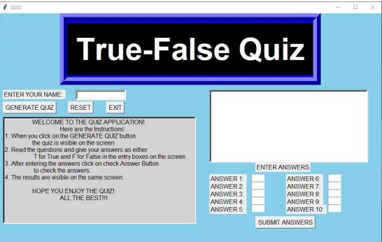
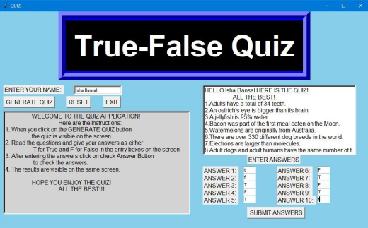
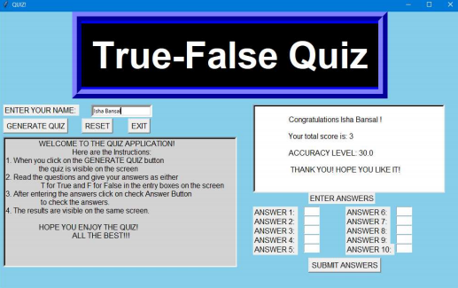

# TRUE-FALSE-QUIZ-APPLICATION
## Movtivation Behind the Application
Reading from textbooks often fails to grab our attention and most children find that quizzes are fun so it is a great way of learning. School tests can be an anxious experience for children. They often worry how well they will do, how their results compare to those of their friends or what the teacher will think of them. Playing quizzes at home is much less stressful and provides a means to test ourselves. 

Hence, I chose the project to build a simple True and False Quiz Application. 

## Going Inside the Application
#### Buttons Present in the Application
1. Generate Quiz – It will generate the quiz on the black screen in the
application.
2. Reset – It will reset everything to blank.
3. Exit – To exit the application. 

## Screenshots of the Game

#### Final Layout of the game

#### Displaying the Quiz on clicking Generate Quiz Button

#### Entering the answers for the questions given

#### Showing the results of the quiz taken
